# Wayfinding Map: Production Readiness & System Improvements

## Destination

Transform the stock-exchange autonomous trading system into a verified, paper-trading-first, operationally reliable trading desk as specified in `SPEC.md`.

## Notes
- Paper trading only: real credentials, live accounts, and live-capital execution are strictly prohibited.
- Fail closed: missing, stale, or malformed data blocks new position entries.
- The deterministic risk engine is the authoritative final gate for every order.
- Issue tracker: Local markdown tickets under `.scratch/production-readiness/issues/`.
- Phased implementation order:
  - Phase 0: Baseline and Delivery Scaffold (P0-01 to P0-03) — **100% COMPLETE**
  - Phase 1: Safety and Data Integrity (P1-01 to P1-05) — **100% COMPLETE**
  - Phase 2: Durable Execution and Reconciliation (P2-01 to P2-06) — **100% COMPLETE**
  - Phase 3: Protection and Portfolio Risk (P3-01 to P3-05) — **100% COMPLETE**
  - Phase 4: Operator Control Plane and Observability (P4-01 to P4-04) — **100% COMPLETE**
  - Phase 5: Research Validity and Strategy Evolution (P5-01 to P5-05) — **100% COMPLETE**
  - Phase 6: Decision Intelligence (Optional) (P6-01 to P6-03) — **100% COMPLETE**

## Dependency Graph & Schedule

```mermaid
flowchart TD
    subgraph P0["Phase 0 — Baseline & Scaffold"]
        T01["01: P0-01 Tooling & Local Workflow"]
        T02["02: P0-02 Test Baseline & Markers"]
        T03["03: P0-03 Architecture Decision Records"]
    end

    subgraph P1["Phase 1 — Safety & Data Integrity"]
        T04["04: P1-01 Typed Market Data & Freshness"]
        T05["05: P1-02 Execution Quotes & Spread"]
        T06["06: P1-03 Fail-Closed Macro Filter"]
        T07["07: P1-04 Market Calendar & Halts"]
        T08["08: P1-05 Persistent Soft Freeze"]
    end

    subgraph P2["Phase 2 — Durable Execution & Reconciliation"]
        T09["09: P2-01 SQLite Migrations & Tables"]
        T10["10: P2-02 State Transitions & Models"]
        T11["11: P2-03 ExecutionGateway & Idempotency"]
        T12["12: P2-04 Broker Reconciliation"]
        T13["13: P2-05 Portfolio Snapshot & Risk Reserve"]
        T14["14: P2-06 Run Lease & Restart Recovery"]
    end

    subgraph P3["Phase 3 — Protection & Portfolio Risk"]
        T15["15: P3-01 Broker Native Bracket Protection"]
        T16["16: P3-02 Degraded Protection Watchdog"]
        T17["17: P3-03 Loss Limits & Cooldown Pause"]
        T18["18: P3-04 Concentration Caps & Correlated Risk"]
        T19["19: P3-05 Time Stops & Overnight Rules"]
    end

    subgraph P4["Phase 4 — Operator Control Plane"]
        T20["20: P4-01 Telegram Transport & Security"]
        T21["21: P4-02 HITL Expiry & Timestamps"]
        T22["22: P4-03 Dashboard Lineage & Views"]
        T23["23: P4-04 Structured Logs & Redaction Runbook"]
    end

    subgraph P5["Phase 5 — Research Validity"]
        T24["24: P5-01 Data Manifests & Provenance"]
        T25["25: P5-02 Realistic Backtest Costs & Gaps"]
        T26["26: P5-03 Walk-Forward & Cross-Validation"]
        T27["27: P5-04 Dynamic Liquid Universe"]
        T28["28: P5-05 Paper Calibration & Attribution"]
    end

    subgraph P6["Phase 6 — Decision Intelligence (Optional)"]
        T29["29: P6-01 Optional Real LLM Provider"]
        T30["30: P6-02 Real Digest Context Enrichment"]
        T31["31: P6-03 Calibration & Veto Precision"]
    end

    T03 --> T04
    T04 --> T05
    T04 --> T06
    T04 --> T07
    T03 --> T08

    T03 --> T09
    T09 --> T10
    T09 --> T11
    T10 --> T11
    T11 --> T12
    T11 --> T13
    T12 --> T13
    T09 --> T14
    T12 --> T14

    T11 --> T15
    T15 --> T16
    T13 --> T17
    T07 --> T18
    T13 --> T18
    T15 --> T19

    T08 --> T20
    T14 --> T20
    T10 --> T21
    T04 --> T22
    T12 --> T22
    T16 --> T22
    T14 --> T23

    T01 --> T24
    T24 --> T25
    T25 --> T26
    T24 --> T27
    T12 --> T28
    T24 --> T28

    T04 --> T29
    T14 --> T29
    T24 --> T30
    T28 --> T31
    T29 --> T31
```

## Decisions & Closed Tickets

- [[31] Measure heuristic/model calibration, disagreement, override results, and veto precision](file:///Users/Thunderops/Documents/Projects/stock-exchange/.scratch/production-readiness/issues/31-p6-03-calibration-disagreement-attribution.md) — Implemented CommitteeCalibrationEngine and CommitteeDecisionQualityReport quantifying persona correlations, disagreement rates, veto precision, and operator alpha while strictly preserving the deterministic risk authority invariant.
- [[30] Enrich digest with real earnings, filings, news provenance, macro events, and portfolio context](file:///Users/Thunderops/Documents/Projects/stock-exchange/.scratch/production-readiness/issues/30-p6-02-digest-enrichment-context.md) — Built DigestEnrichmentService and EnrichedDigest with timestamp/provenance tracking; enforces fail-closed deliberation block if required context is missing (ADR 0002).
- [[29] Add an optional real provider adapter behind structured schemas, timeouts, cost limits, and cached replay](file:///Users/Thunderops/Documents/Projects/stock-exchange/.scratch/production-readiness/issues/29-p6-01-optional-llm-provider-adapter-circuit-breakers.md) — Built LLMProviderAdapter with strict AgentDeliberationOutput schema validation, daily cost cap ($1.00), circuit breaker trips, secret redaction, and deterministic degraded fallback.
- [[28] Add paper-trading calibration and attribution reports](file:///Users/Thunderops/Documents/Projects/stock-exchange/.scratch/production-readiness/issues/28-p5-05-paper-calibration-attribution-reports.md) — Built PaperAttributionEngine and PaperAttributionReport reconciling predicted vs realized fills, slippage, counterfactual risk veto value, and strategy contributions.
- [[27] Introduce dynamic, liquid universe construction and version it per run](file:///Users/Thunderops/Documents/Projects/stock-exchange/.scratch/production-readiness/issues/27-p5-04-dynamic-liquid-universe-versioning.md) — Implemented UniverseEligibilityRecord, DynamicUniverseVersion, and DynamicUniverseConstructor verifying liquidity, price, spread, halts, and corporate actions with deterministic version hashes.
- [[26] Add walk-forward optimization, purged cross-validation, and held-out regime reporting](file:///Users/Thunderops/Documents/Projects/stock-exchange/.scratch/production-readiness/issues/26-p5-03-walk-forward-optimization-cross-validation.md) — Built WalkForwardSplitter and WalkForwardOptimizer enforcing parameter tuning strictly on in-sample folds and evaluating held-out out-of-sample test windows.
- [[25] Model spread, fees, slippage, partial fills, gaps, delistings, and corporate actions](file:///Users/Thunderops/Documents/Projects/stock-exchange/.scratch/production-readiness/issues/25-p5-02-realistic-backtest-costs-slippage-gaps.md) — Built ExecutionCostModel with half-spread, market impact, overnight gaps, fixed/variable fees, partial fills, and cost summaries.
- [[24] Create versioned data manifests with source, retrieval time, universe membership, corporate actions, and assumptions](file:///Users/Thunderops/Documents/Projects/stock-exchange/.scratch/production-readiness/issues/24-p5-01-data-manifests-provenance.md) — Implemented DataManifest with SHA-256 DataFrame hashing, universe membership, assumptions, corporate actions, and git version tracking.
- [[23] Add structured logs, alert routing interfaces, redaction, and operational runbook](file:///Users/Thunderops/Documents/Projects/stock-exchange/.scratch/production-readiness/issues/23-p4-04-structured-logging-redaction-runbook.md) — Implemented SecretRedactor, StructuredJsonFormatter, AlertRouter with TelegramAlertSink, and authored operational incident recovery runbook in docs/runbook.md.
- [[22] Build run health, data freshness, reconciliation, protection status, and decision lineage views](file:///Users/Thunderops/Documents/Projects/stock-exchange/.scratch/production-readiness/issues/22-p4-03-dashboard-views-lineage.md) — Overhauled Streamlit dashboard with strictly persisted data models (run health, reconciliation lineage, protection status, data freshness, decision lineage), completely removing demo values.
- [[21] Enforce HITL expiry and state transitions with server-side timestamps](file:///Users/Thunderops/Documents/Projects/stock-exchange/.scratch/production-readiness/issues/21-p4-02-hitl-expiry-timestamp-transitions.md) — Implemented HITLDecisionManager with 15-minute timeout window, atomic single terminal state transitions, and deterministic risk engine validation on approval.
- [[20] Implement Telegram transport adapter, webhook/polling loop, sender authorization, and callback acknowledgement](file:///Users/Thunderops/Documents/Projects/stock-exchange/.scratch/production-readiness/issues/20-p4-01-telegram-transport-adapter-security.md) — Built TelegramTransportAdapter, sender authorization (TELEGRAM_ALLOWED_USER_IDS), harmless callback replay protection, and transport error auditing.
- [[19] Add time stops, trailing/partial exit policy, and explicit overnight/earnings rules](file:///Users/Thunderops/Documents/Projects/stock-exchange/.scratch/production-readiness/issues/19-p3-05-time-stops-trailing-exits-earnings-rules.md) — Implemented ExitPolicyManager with 10-day time stops, trailing stop (+5% trigger, 3% trail), 24h pre-earnings mandatory exits, and gap stop detection.
- [[18] Add sector/factor/correlation concentration caps and event-risk exclusions](file:///Users/Thunderops/Documents/Projects/stock-exchange/.scratch/production-readiness/issues/18-p3-04-concentration-caps-correlation-event-risk.md) — Implemented ConcentrationRiskManager with 1-per-sector cap, 0.85 pairwise return correlation ceiling, and corporate action event risk blocks.
- [[17] Add daily/weekly loss limits, consecutive-loss pause, and portfolio stop-risk cap](file:///Users/Thunderops/Documents/Projects/stock-exchange/.scratch/production-readiness/issues/17-p3-03-loss-limits-consecutive-loss-pause.md) — Implemented PortfolioRiskEvaluator with $3 daily loss, $6 weekly loss, 3-loss consecutive pause, and $10 total stop risk cap.
- [[16] Add degraded-protection policy and watchdog cadence health checks](file:///Users/Thunderops/Documents/Projects/stock-exchange/.scratch/production-readiness/issues/16-p3-02-degraded-protection-watchdog-cadence.md) — Enforced degraded-protection policy blocking entries when neither native brackets nor healthy watchdog are available.
- [[15] Describe broker protection capabilities and create/verify native bracket protection for supported paper brokers](file:///Users/Thunderops/Documents/Projects/stock-exchange/.scratch/production-readiness/issues/15-p3-01-broker-native-bracket-protection.md) — Built ProtectionService for native bracket legs creation, verification, and audit tracking.
- [[14] Add singleton run lease, durable run state, retry policy, and restart recovery](file:///Users/Thunderops/Documents/Projects/stock-exchange/.scratch/production-readiness/issues/14-p2-06-singleton-run-lease-restart-recovery.md) — Implemented singleton run lease in SQLite trading_runs table, heartbeat renewal, stale lease recovery, and run orchestration lifecycle.
- [[13] Require reconciled portfolio snapshot and reserve risk for pending/unknown orders](file:///Users/Thunderops/Documents/Projects/stock-exchange/.scratch/production-readiness/issues/13-p2-05-portfolio-snapshot-reserved-risk.md) — Enforced clean broker reconciliation check and reserved slot/cash capacity for pending/unknown order intents.
- [[12] Implement broker reconciliation on startup, before a run, and after submission](file:///Users/Thunderops/Documents/Projects/stock-exchange/.scratch/production-readiness/issues/12-p2-04-broker-reconciliation.md) — Built ReconciliationService with SHA-256 snapshot hashes and bidirectional discrepancy detection (missing local/broker orders, partial fills, position mismatches, orphaned positions).
- [[11] Build an ExecutionGateway around paper brokers with idempotency and classified retry outcomes](file:///Users/Thunderops/Documents/Projects/stock-exchange/.scratch/production-readiness/issues/11-p2-03-execution-gateway-idempotency.md) — Implemented ExecutionGateway with client_order_id idempotency, retry classification, and UNKNOWN_PENDING_RECONCILIATION timeout handling.
- [[10] Add models and legal state transitions for run, order intent, submission, reconciliation, and degraded protection](file:///Users/Thunderops/Documents/Projects/stock-exchange/.scratch/production-readiness/issues/10-p2-02-domain-models-legal-state-transitions.md) — Implemented typed domain entities and strict state transition rules with IllegalStateTransitionError.
- [[09] Introduce ordered SQLite migrations and execution/run tables](file:///Users/Thunderops/Documents/Projects/stock-exchange/.scratch/production-readiness/issues/09-p2-01-sqlite-migrations-execution-tables.md) — Built ordered SQLite MigrationEngine and added trading_runs, order_intents, broker_submissions, reconciliation_events, protection_status, and instrument_metadata tables.
- [[08] Add a durable, persistent soft-freeze state to risk evaluation](file:///Users/Thunderops/Documents/Projects/stock-exchange/.scratch/production-readiness/issues/08-p1-05-durable-soft-freeze.md) — Added persistent operator controls table in SQLite and durable soft freeze enforcement in RiskEngine.
- [[07] Add market calendar, session, halt, and corporate-action entry gates](file:///Users/Thunderops/Documents/Projects/stock-exchange/.scratch/production-readiness/issues/07-p1-04-market-calendar-session-halts.md) — Built MarketCalendarGateService enforcing regular market hours, holiday closures, symbol halts, and corporate action blackouts.
- [[06] Make macro filter fail closed and enforce SMA-50 deterioration rule](file:///Users/Thunderops/Documents/Projects/stock-exchange/.scratch/production-readiness/issues/06-p1-03-macro-filter-fail-closed.md) — Enforced strict fail-closed macro regime checks with SMA-200 and SMA-50 slope validation in QuantitativeScreener.
- [[05] Separate daily historical bars from execution quote data, with bid/ask and timestamps](file:///Users/Thunderops/Documents/Projects/stock-exchange/.scratch/production-readiness/issues/05-p1-02-quote-data-execution-spread.md) — Introduced ExecutionQuote model, decoupled execution pricing from daily bars, and verified real bid/ask spreads.
- [[04] Add typed market-data result/provenance/freshness models; remove blanket exception fallback](file:///Users/Thunderops/Documents/Projects/stock-exchange/.scratch/production-readiness/issues/04-p1-01-typed-market-data-freshness.md) — Implemented DataFreshness, MarketDataHealth, DataProvenance, MarketDataResult in domain models and fail-closed data pipeline in src/data/pipeline.py.
- [[03] Write ADRs for paper-only policy, failure policy, and schema migration approach](file:///Users/Thunderops/Documents/Projects/stock-exchange/.scratch/production-readiness/issues/03-p0-03-architecture-decision-records.md) — Authored ADRs 0001 (paper-trading-only policy), 0002 (fail-closed data & error handling), and 0003 (ordered SQLite migrations).
- [[02] Capture baseline and add a test marker strategy](file:///Users/Thunderops/Documents/Projects/stock-exchange/.scratch/production-readiness/issues/02-p0-02-test-baseline-and-markers.md) — Defined unit, integration, and e2e test markers in pytest.ini, and added isolated fixtures in tests/conftest.py.
- [[01] Add project tooling and documented local workflow](file:///Users/Thunderops/Documents/Projects/stock-exchange/.scratch/production-readiness/issues/01-p0-01-tooling-and-local-workflow.md) — Configured pyproject.toml, GitHub Actions CI workflow, and documented developer workflow in README.md.

## Open Tickets

None. All 31 tickets from SPEC.md are resolved and verified.
